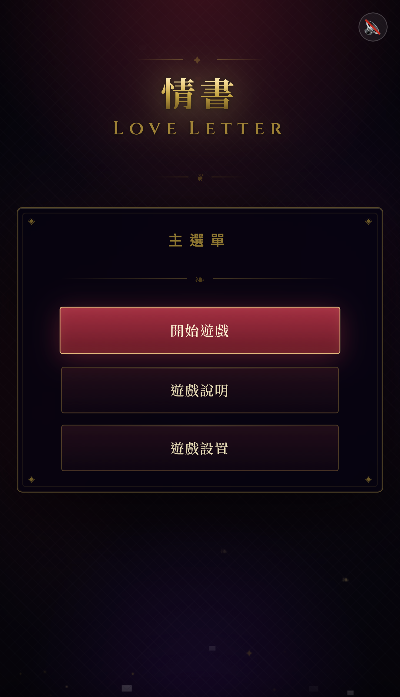
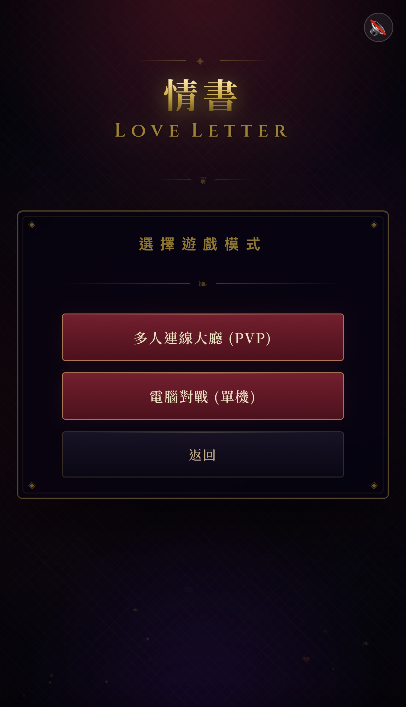
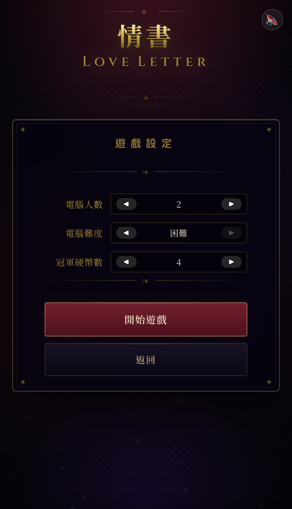
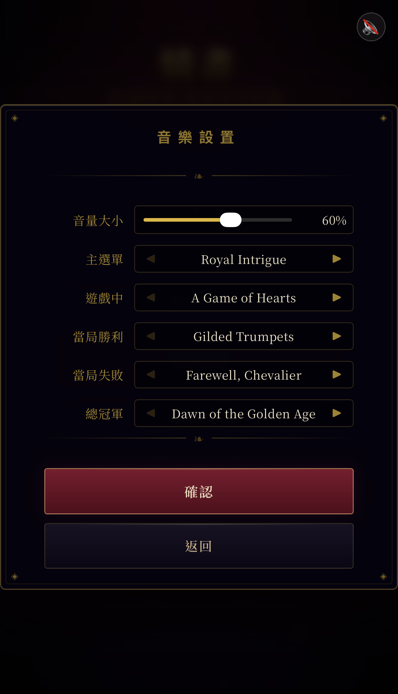
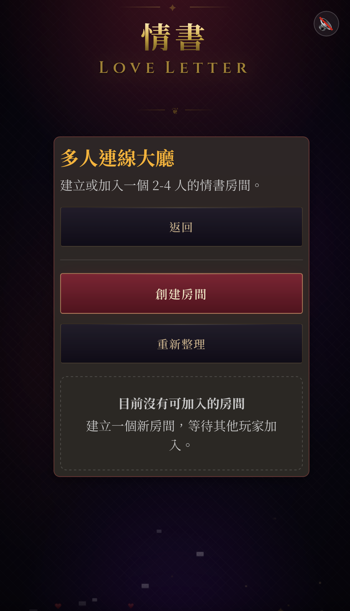
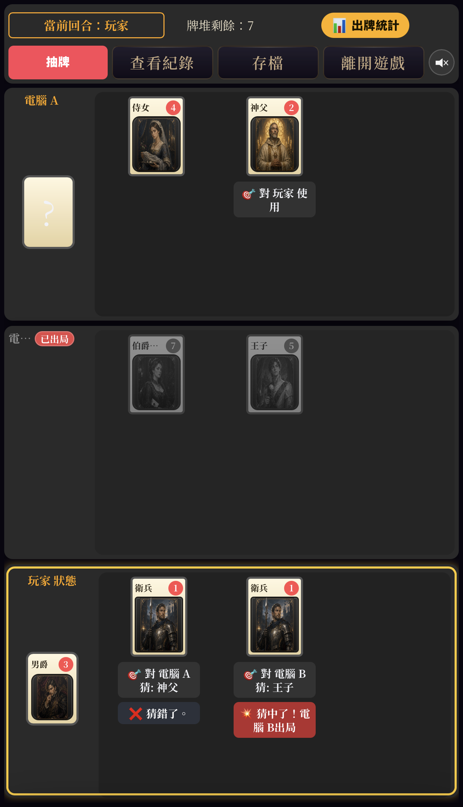

<div align="right">

**English** | [繁體中文](README.zh-TW.md)

</div>

# Love Letter — Web Edition


## Play Now

Play it right here: <https://frankkn.github.io/love-letter/>

This is a web version of the card game *Love Letter*, built with TypeScript, Vite, and vanilla DOM. It features single-player battles against AI, an online multiplayer lobby (with in-room AI bots), a multilingual interface, background music and sound effects, real-time text chat, WebRTC voice chat, and a mobile-friendly UI.

## Screenshots

<table>
  <tr>
    <td align="center"><br/>Main menu</td>
    <td align="center"><br/>Game mode selection</td>
    <td align="center"><br/>Game settings</td>
  </tr>
  <tr>
    <td align="center"><br/>Music settings</td>
    <td align="center"><br/>Multiplayer lobby</td>
    <td align="center"><br/>In-game battle scene</td>
  </tr>
</table>

## Objective

In each round, players eliminate their opponents through card effects, or win by holding the highest-value hand when the deck runs out. The first player to collect the target number of coins (4 by default, freely configurable before the game starts) becomes the league champion.

## Features

- Multilingual
  - Game Settings → Language Settings, with support for Traditional Chinese and English.
  - The language preference is stored in localStorage and persists across page reloads.
  - All UI text, card names, game logs, and modal content update instantly when switching languages.

- Game settings
  - Music settings: pick a track for each of five scenes (main menu / in-game / round victory / round defeat / championship), with preview playback; selections are stored in localStorage.
  - Automatic music discovery: drop MP3 files into the `public/audio/{slot}/` subfolders and they appear in the menu.

- Single-player mode
  - Supports 2- to 4-player games.
  - Play against 1 to 3 AI bots, with a shared difficulty setting (Easy / Medium / Hard).
  - Configure the championship coin target (1–10, default 4) before the game starts.
  - Fully implements all 8 Love Letter card effects: Guard, Priest, Baron, Handmaid, Prince, King, Countess, Princess.
  - Save system: the game auto-saves after the player draws a card, and a "Continue Game" button appears on the main menu; the game also auto-saves when you exit; the save is automatically cleared once a champion is crowned.
  - PWA support: assets are cached locally after the first visit, so the page loads and single-player games work even without a network connection.

- Online multiplayer mode
  - Room lobby and waiting room built with Colyseus.
  - Supports creating rooms, joining rooms, ready states, and host-initiated game start.
  - The host can add AI bots (Bot A/B/C) to fill empty seats and set each bot's difficulty individually (Easy / Medium / Hard).
  - The host can set the championship coin target (1–10); the setting syncs to all room members in real time.
  - The host can kick human players; kicked players return to the lobby.
  - When the game starts, the initial game state is synced so all players enter the same match.
  - After a league ends, everyone can confirm to restart directly — no need to return to the main menu and recreate the room.
  - Invite links: the waiting room lets you copy a `?room=<roomId>` share link; friends who open it join directly via an in-game dialog. The link automatically becomes invalid when the room is full.
  - Disconnect and reconnect: an unexpected disconnect opens a 60-second reconnection window, letting you click reconnect to resume the game or choose to forfeit; even after an F5 page refresh, the reconnect prompt automatically reappears within the window.
  - A disconnect banner shows in real time which player is offline; if the host stays disconnected past the timeout the room is dissolved, and if a non-host player times out the host eliminates them (the reconnect window, dissolution, and elimination timers are all unified at 60 seconds).
  - Emoji wheel: open a six-segment emoji wheel in-game (joy / anger / sadness / thinking / ✗ / 100); sent emoji float over the corresponding player's hand area, visible to everyone in real time, with a 3-second cooldown.
  - Text chat: open the chat panel in-game to exchange messages, with an unread-message badge counter.
  - Voice chat: full-mesh P2P WebRTC voice with Colyseus handling only the signaling, including a speaking-detection indicator.

- AI logic
  - Three difficulty levels (Easy / Medium / Hard); in single-player mode all bots share one setting, while in multiplayer each bot can be configured individually.
  - Difficulty differences:

    | AI&#8288;behavior | Easy | Medium | Hard |
    | --- | --- | --- | --- |
    | Memory | Does not remember Priest, King, or Baron information | Remembers known hands | Same as Medium, plus makes use of Baron clues |
    | Guard&#8288;guessing | Mostly random, does not avoid past wrong guesses | Prioritizes known cards, avoids previously wrong guesses, weights by remaining card counts | Same as Medium, plus uses Baron duel outcomes to narrow the guess range |
    | Play&#8288;strategy | Near-random, but avoids discarding the Princess when possible | Guard targets known hands first; Baron avoids opponents known to beat it | Same as Medium; Baron additionally estimates win rates from the remaining card distribution and picks the most favorable target; Handmaid is used more wisely for self-protection |
    | Advanced&#8288;judgment | None | Uses the Prince to force a discard when it knows an opponent holds the Princess | Pressures the coin leader; avoids King-stealing high cards when a Guard counter-kill is a risk |
    | Common&#8288;safeguards | Avoids obviously suicidal plays whenever possible | Same as Easy | Same as Easy |

- Music and sound effects
  - Five scenes (main menu, in-game, round victory, round defeat, championship) can each have their own track, selectable and previewable in the game settings.
  - Elimination, round-end, and championship sound effects all use the player-selected track for the corresponding slot.
  - A mute button is available on every screen, with the preference stored in localStorage.

- Mobile UI
  - Battlefield proportions restructured for portrait phone screens.
  - The played-card statistics moved to a floating button.
  - Battle logs moved into a modal view, freeing up space on the main screen.
  - Card hint text is bound to the same vertical container as the card, preventing overlapping hints.

## Tech Stack

- TypeScript
- Vite
- Vanilla DOM
- CSS Grid / Flexbox
- Colyseus
- WebRTC (Mesh P2P voice)
- Web Audio API
- Playwright

## Project Structure

```text
.
├── index.html
├── package.json
├── public/
│   ├── splash.webp
│   ├── audio/
│   └── icons/
├── src/
│   ├── main.ts              # Main entry: scene switching, turn flow, event wiring
│   ├── style.css
│   ├── i18n.ts              # Multilingual strings
│   ├── utils.ts             # Pure utility functions
│   ├── assets/cards/        # Card images
│   ├── audio/
│   │   └── music.ts         # BGM / SFX control
│   ├── domain/              # Game domain logic (pure functions, no DOM)
│   │   ├── cards.ts         # Card definitions and deck
│   │   ├── game-state.ts    # Game state types
│   │   ├── online-types.ts  # Online sync types
│   │   ├── ai-memory.ts     # AI memory and clue system
│   │   └── ai-strategy.ts   # AI play / guess strategy
│   ├── net/                 # Network layer
│   │   ├── invite-url.ts    # Invite link utilities
│   │   ├── online-reconcile.ts   # Local state reconciliation
│   │   ├── online-serialization.ts # Sync serialization / deep copy
│   │   └── room-types.ts    # Lobby room types
│   ├── storage/
│   │   └── offline-save.ts  # Single-player saves (localStorage)
│   ├── ui/                  # UI components and DOM helpers
│   │   ├── card-render.ts   # Card DOM generation
│   │   ├── chat.ts          # Chat controller
│   │   ├── elements.ts      # Common DOM element references
│   │   ├── emoji.ts         # Emoji wheel controller
│   │   ├── modal-templates.ts # Modal body builders
│   │   ├── particles.ts     # Particle system
│   │   ├── player-badges.ts # Player nameplates / coins
│   │   └── voice.ts         # WebRTC voice controller
│   └── server/              # Colyseus backend (Node.js, compiled separately)
│       ├── index.ts
│       ├── rooms/
│       │   └── LoveLetterRoom.ts
│       └── schema/
│           ├── GameRoomState.ts
│           └── PlayerState.ts
├── tests/
└── vite.config.ts
```

## Local Development

Install dependencies:

```bash
npm install
```

Start the frontend dev server:

```bash
npm run dev
```

Default URL:

```text
http://localhost:5173
```

Build the frontend:

```bash
npm run build
```

Preview the production build:

```bash
npm run preview
```

## Colyseus Backend

Build the backend:

```bash
npm run build:server
```

Start the backend:

```bash
npm run start:server
```

When deploying to Render, make sure the environment variables and the frontend's Colyseus endpoint are configured correctly.

## Testing

Run the Playwright tests:

```bash
npm run test:e2e
```

## Release Notes

### v2.11.0 - Second Code Review Round: Notification XSS, Reconnect Champion Threshold, AI Memory Rollback, and Server Throttling

This release comes out of a second full code review, comprising 6 independent fixes.

**Security / anti-cheat**

- Patched a stored XSS in online notification modals: notifications (Guard eliminations/wrong guesses, Priest peeks, Prince forcing a Princess discard, etc.) were broadcast as raw HTML in `bodyHTML` via `sync_game_state`, and the receiving end rendered it with `innerHTML` without escaping — any room member could forge a sync payload and execute arbitrary scripts in other players' browsers (names, battle logs, and card hints were already protected in earlier releases; this channel was the one remaining gap). The payload now carries plain-text `bodyText`, assembled and escaped locally on the receiving end; the `bodyHTML` field is kept (pre-escaped on send) so older clients in mixed-version rooms can still display it, and new clients escape the legacy field before rendering as well.
- Server-side message rate limiting: `chat_message` / `emoji_react` / `sync_game_state` previously had no server-side rate cap (the emoji cooldown existed only on the client), so a modified client could flood the whole room at high frequency (and `maxPayload` had already been raised to 1MB). Added a per-connection sliding-window throttle (sync 120 / 10s, chat 10 / 10s, emoji 8 / 10s) — limits far above normal peaks (effect chains produce roughly 10–20 syncs) — with excess messages silently dropped, so legitimate games are never affected.

**Multiplayer**

- Fixed the championship coin threshold drifting on clients that reconnect after a page refresh: the reconnect branch of `initOnlineGame` returned early without re-reading the room's `championCoins` setting, so after a reload the module-level default of 4 took effect — in a room set to 6 coins, that client would show the champion screen at 4 coins (with the rules text and leaderboard copy equally wrong). The reconnect branch now restores the threshold the same way as the normal join path.

**AI / rules**

- Fixed the "select a card, then cancel" exploit that wiped bot memory: `executePlayCard` cleared the `aiMemory` intel about the card player and the Guard wrong-guess records at the moment the card was played (before the still-cancelable target/guess selection stage), while the cancel rollback only restored the hand / discards / battle log. A player could repeatedly select and cancel to make Medium/Hard bots forget Priest peeks and wrong-guess intel. `PlayRollback` now includes deep-copy snapshots of both memory stores and restores them on cancel.

**Maintenance / testing**

- Patched a WebRTC voice resource leak: `setupRemoteAudio` created a new `MediaStreamSource` + `AnalyserNode` on every `ontrack` without disconnecting the old chain, and the shared `AudioContext` was never closed, so repeatedly joining/leaving voice during long matches accumulated OS audio resources. Source nodes are now tracked per peer, `disconnect`ed on track changes and cleanup, and the AudioContext is `close()`d when leaving voice.
- Corrected an outdated comment in `server/index.ts`: the reconnect window is 60 seconds (`allowReconnection(client, 60)`), not the 20 seconds the comment claimed.
- All 36 E2E tests pass; frontend / backend / test-server tsc type checks and the production build pass.

**Deployment note**: this release includes backend changes (message rate limiting), so the Colyseus server must be redeployed for it to take full effect.

### v2.10.0 - Full Code Review Fixes: Reconnect State Corruption, AI Amnesia, XSS, and Audio Stability

This release comes out of a full code review (domain / main / net / server / ui / audio), comprising 13 independent fixes.

**Multiplayer (high priority)**

- Fixed a severe bug where the host reconnecting after an F5 page refresh would destroy the entire game: the reconnect path had the host "replay its local authoritative state", but after a page reload the in-memory `state` is the startup-time fake single-player game (player + Bot A), and that bogus state got broadcast to everyone and overwrote the server's `latestGameState`. Fix: a new `lastAppliedOnlineRoomId` tracks which online room was actually applied during this page lifetime; the host only replays when the in-memory state is confirmed to belong to the current room (disconnected but not reloaded). A reloaded host instead sends `request_game_data` to fetch the latest snapshot from the server, just like a guest.
- Fixed online bot amnesia: `applyOnlineGameState` reset the entire `aiMemory` / `aiExcludedGuesses` / Baron clue stores on every applied sync. Bots run only on the host, so as soon as any non-host player's action synced back to the host, everything Medium/Hard bots had learned (Priest peeks, King swaps, Guard wrong-guess records) was wiped. Now: once the game is initialized and within the same round, the host preserves AI memory; round changes and new games still reset as before.
- `endGameReason` is now part of the sync payload: previously only the client that dealt the final blow generated the end-reason string, so other players' end-of-round modals had an empty reason field.

**Security / anti-cheat**

- Patched a stored XSS in the battle log modal: `state.logs` is synced verbatim from other clients (injectable via forged syncs), yet the log modal rendered it with `innerHTML` without escaping (the sidebar log used `textContent`, and card hints were escaped in v2.9.3 — this was the one spot missed). Now escaped with `escapeHTML`.
- Kicking now forces a server-side disconnect (`targetClient.leave()`): previously the player was only removed from room state and notified, so a malicious client could ignore the notification and keep receiving all room broadcasts (state, chat).
- `emoji_react` impersonation protection: `playerId` is now derived server-side from the sender's session (players-map insertion-order index, matching the frontend's game player order) instead of trusting the payload, so no client can send emoji as someone else's seat.

**Music / sound effects**

- Fixed audio dying permanently after a single rejected `play()`: the audio-unlock listener was registered with `once: true`; when `playBGM` failed, `audioUnlocked` was reset to false to await the next gesture, but the listener had already been consumed and would never fire again, leaving audio dead until a page reload. The listener is now persistent (a no-op once unlocked).
- Fixed state corruption when a sound effect interrupted a still-loading BGM: pausing a BGM whose `play()` promise hadn't resolved throws an `AbortError`, and the old catch treated every rejection as an autoplay block and cleared `currentBGMFile`, breaking the "same-track early-return + `stopSFX`" fast path — pressing "Next round" no longer interrupted the victory/defeat music (a regression of the v2.8.5 fix under slow loading). Interruptions caused by our own pause no longer reset the unlock state.

**AI / rules**

- Guard wrong-guess records are now cleared on "play" instead of "draw": drawing a second card doesn't change the original held card, so the wrong-guess intel is still valid at that point; clearing early made bots throw away a step of intel for nothing.
- Target filtering now excludes players with empty hands (defensive): unreachable in normal flow (`checkEndConditions` settles first when both the deck and the burned card are exhausted), but if that invariant ever broke, Guard/Priest resolution would crash on `target.hand[0]`.

**Maintenance / testing**

- `initGame` now also resets `restartReadyPlayerIds` (consistent with the other per-round reset lists).
- Played-card counting logic extracted into `getPlayedCardCounts()`, shared by the sidebar and the modal.
- Corrected the outdated `preserveHostBotHands` comment (bot hands have been fully synced since v2.8.0, making the function a defensive no-op), and documented the trusted-peer model's visibility trade-off explicitly in CLAUDE.md.
- Added `--autoplay-policy=no-user-gesture-required` to Playwright Chromium, eliminating flaky audio-test failures under heavily loaded parallel runs.
- All 36 E2E tests pass; frontend / backend / test-server tsc type checks pass.

**Deployment note**: this release includes backend changes (kick disconnect, emoji impersonation protection), so the Colyseus server must be redeployed for it to take full effect.

### v2.9.4 - Server-Side sync_game_state Forgery Validation (Partial Mitigation)

**Security / anti-cheat**

- Under the trusted-peer sync model, any client can broadcast a full game state, letting a malicious player conjure cards out of thin air or instantly pump their coins to the champion threshold. This release adds a lightweight forgery gate on the server when receiving `sync_game_state`: syncs judged forged are **dropped** (not stored, not forwarded) and a warning is logged.
- Since game logic still runs on the clients (not server-authoritative), the gate **only rejects transitions that are physically impossible in a legitimate game**, and is deliberately designed for **zero false positives** — wrongly killing one legitimate sync would deadlock the turn, a cost far higher than letting a cheat through. Two checks:
  - **Card conservation**: with a 16-card deck, `deck + burned + all hands + all discards` must always equal 16; anything `> 16` means injected cards.
  - **Coin monotonicity**: with reliable WebSocket ordering, one sync settles at most one round, so any player gaining `+2` or more relative to the last server-observed state is a forged win; coin decreases are allowed (a new league legitimately resets to zero).
- The whole gate is wrapped in `try/catch`; any parsing uncertainty or exception **fails open (allows the sync)**, guaranteeing that a flaw in the gate itself can never block a legitimate sync.
- **Scope disclaimer (honest)**: this raises the bar and keeps honest people honest — it is not a cure. It stops the most disruptive tricks (conjuring cards, instant championships, faking someone's elimination with impossible card counts), but it **cannot stop** a player who forges wins slowly (+1 per round during their own legitimate turn) or forges everyone's coins back to zero (indistinguishable from a legitimate league restart). A real fix requires server-authoritative resolution (a major refactor). This release is backend-only; redeploy the backend for it to take effect.

### v2.9.3 - Security Hardening and Online Sync / Tie Settlement Fixes

**Security**

- Patched stored XSS via player nicknames and card hints. Nicknames are sent to the server on room join and broadcast to everyone; and under the trusted-peer sync model, any client can forge a full game state (including player names and card action hints). Several render points (target selection buttons, Baron/King reveals, card action hints) inserted them via `innerHTML` without escaping, so a malicious nickname or forged hint text could execute in other players' browsers.
- Fix (layered): sanitize nicknames at the trust boundaries with `sanitizePlayerName` (strips `<` / `>` and enforces a length limit) — server `onJoin`, `cloneOnlinePlayer` (covering forged inbound syncs), and `createOnlinePlayers`. Removal was chosen over entity encoding so the same string renders identically in both `innerHTML` and `textContent` contexts. Card rendering additionally escapes `hint.text` with `escapeHTML` and whitelists the variant class (hint text is free-form and directly injectable via forged syncs, independent of nicknames); the modal's target buttons and reveal names are escaped as well.

**Multiplayer**

- Fixed a desync in online games where playing a Guard, choosing a target (at which point the play had already been broadcast to everyone), and then pressing cancel in the guess dialog rolled back only locally without re-broadcasting — other players kept seeing the played Guard and a wrong hand count (self-healing only on the player's next play). Fix: `restorePlayRollback` now sends one extra sync after the cancel rollback (a no-op offline; canceling at the target-selection stage is idempotent).

**Game rules**

- Fixed the deck-exhaustion showdown so that when multiple survivors tie on both hand value and discard total, they all win instead of just one. Per Love Letter rules, tied players win together and each gains a coin: `endGame` counts the primary winner and `checkEndConditions` adds the remaining tied winners, synced to all clients. The showdown modal now highlights all tied winners, and ties are written to the battle log (new `log.tieWin`).

**Known limitations**

- Under the trusted-peer sync model the server still trusts full game states from any client (the source cannot simply be restricted without breaking non-host turns and the Baron/King duel confirmation flow); the real fix is server-authoritative resolution. This release removes the exploitable XSS surface via the boundary sanitization and output escaping above.

**Testing**

- Frontend and backend (`npm run build`, `npm run build:server`) type checks / builds pass.

### v2.9.2 - Fix for Turn Deadlock When a Baron / King / Prince Chain Participant Disconnects

**Multiplayer**

- Fixed a rare but hard-locking bug in online games (3+ players): when a Baron or King targeted a human opponent, or a Prince forced-discard chain was pending, and that opponent disconnected before pressing confirm / resolving the forced effect, the card player's turn would hang forever. Baron duels and King swaps require both sides to confirm, and Prince chains require the targeted player to resolve the forced effect themselves; once the opponent disconnects, that confirmation/resolution never arrives, and the host's disconnect-elimination flow did not release these pending interactions.
- Fix (host-side, released in `eliminateDisconnectedPlayer`):
  - Baron / King: if the opponent (target) disconnects → **confirm on their behalf**, letting the still-online card player finish resolution (a proxy confirmation is the only signal that can pass through the preserve-interaction guard to reach the card player); if the card player (actor) disconnects → void the interaction (its resolution would only run on the now-offline client) and advance the turn via the elimination handoff.
  - Prince chains: drop the disconnected player's forced-effect entry as reactor; if the queue empties as a result, resume the suspended turn using its `returnTurnPlayerId`.
- Added resolution guards against "opponent already eliminated" state pollution: the King swap now checks both sides are still alive with cards in hand (otherwise voided, preventing the host-as-actor from swapping into an empty hand); the Baron comparison is voided if either side is no longer present (a survivor can no longer lose to someone who already disconnected).

**Testing**

- Added `tests/departed-player-release.spec.ts` (8 cases): Baron/King target proxy confirmation, actor voiding, unrelated players untouched, duplicate-confirmation dedup, forced-effect queue draining with turn handoff, and preserving other reactors. The core decision logic was extracted into pure functions in `online-reconcile.ts` for testability.
- Full suite of 36 E2E / pure-logic tests passes, confirming no regressions.

### v2.9.1 - Fix for "Hand Known to Opponent" Flag Not Resetting Between Rounds

**AI logic**

- Fixed the `handKnownToOpponent` flag (set after a Priest peek or King swap to mark "my current hand is known to an opponent") not being reset when moving to the next round. The new round's hands are freshly dealt and nobody has seen them, yet the flag lingered as `true` from the previous round, misleading the AI.
- Impact: a player who was Priest-peeked in the previous round (and whose flag wasn't cleared by a Prince/King) would enter the new round with the AI wrongly believing their hand was exposed — potentially playing a Prince on itself at the start to "flush" a hand nobody had actually seen, or over-weighting Handmaid plays for self-protection.
- Root cause: `startNextRound` (the shared path for single-player and multiplayer "next round") reuses existing player objects and resets hand / protection / alive / discards / reveal state, but missed `handKnownToOpponent`; every "fresh deal" path (single-player start, online initial deal) sets it to `false` — only the round transition missed it.
- Fix: add `handKnownToOpponent = false` to each player's reset block in `startNextRound`.

**Testing**

- Added `tests/round-reset-hand-known.spec.ts`: uses a DEV-only test hook to mark all players' hands as exposed, triggers a round change, and verifies every flag resets; the test fails with the fix removed and passes with it restored.
- All 27 existing E2E / pure-logic tests pass, confirming no regressions.

### v2.9.0 - Fix for Priest Private Hint Wrongly Attached to Own Hand in Multiplayer

**Multiplayer**

- Fixed a bug in online games (extremely hard to trigger — occasional, once every several rounds) where a Priest "You saw ○○○" private hint would appear under your own hand card. That hint should only ever appear under the Priest you played, lying in the discard pile.
- Root cause: card ids restarted from `card-0` every round, so the same id pointed to different cards in different rounds. On non-host clients, `restoreLocalPrivateHints` re-attached the previous round's private hints to newly received cards by card id. When a new round's hand card happened to reuse the id of last round's Priest, the stale hint got pasted onto the hand card and marked visible to self.
- Fix (two lines of defense): (1) `createDeck` now uses a session-wide incrementing card id, so ids never repeat within a session, eliminating cross-round id collisions at the source; (2) `restoreLocalPrivateHints` gained a round guard — when the received `roundIndex` differs from the local one (round change), private hints are not restored at all.

**Testing**

- Added `tests/private-hint-reconcile.spec.ts` pure-logic regression tests: covering card-id uniqueness across decks, normal same-round restoration, no leakage on cross-round id collision (reproducing this bug), and legacy payloads without `roundIndex` still restoring by id; the cross-round test fails with the round guard removed and passes with it restored.
- All 23 existing E2E tests pass, confirming no regressions.

### v2.8.5 - Fix for Victory/Defeat Music Not Interrupting When the Next Round Starts

**Music / sound effects**

- Fixed the end-of-round settlement modal's victory/defeat music (played on the one-shot `sfxAudio`, pausing the looping in-game BGM) not being interrupted after pressing "Next round" — it kept playing to its natural end before the in-game BGM resumed. Root cause: `showScene('game-scene')` calls `playBGM(gameTrack)`, but since the game track was still the current BGM file, the function early-returned without resuming the BGM or stopping the victory/defeat SFX.
- Fix: when `playBGM` hits the "same BGM but paused by a one-shot SFX" case, it now uses the new `stopSFX()` to force-stop the SFX and immediately resume the in-game BGM. Covers both offline and multiplayer (host and non-host), since every path into the next round ultimately goes through `showScene('game-scene')`.
- Added a state-level Playwright regression test `tests/music-next-round.spec.ts` (reading internal audio state via the DEV-only `window.__testAudioState`), verifying that pressing "Next round" actually interrupts the victory/defeat SFX and restores the in-game BGM as the active track.

### v2.8.4 - Fix for Missing Settlement Modals and Coin Reset After Restarting a League

**Multiplayer**

- Fixed a bug in online games where, after pressing "Restart", every round of the next league ended with no settlement/elimination modal shown — players were taken straight to the next round and the coin tally was reset to zero. Root cause: on non-host clients, the restart confirmation list (`restartReadyPlayerIds`) was only merged in the game-over sync branch and never reset in the regular "new round" sync branch (asymmetric with `nextRoundReadyPlayerIds`). After a unanimous restart, that stale "everyone confirmed" list lingered on non-host clients and was sent back to the host with their next game-over sync; the host wrongly concluded everyone had requested a restart and auto-triggered `startNewLeague()` at the end of the next round, zeroing the coins and closing the modal before anyone saw it.
- Fix: the regular (non-game-over) sync branch now also resets `restartReadyPlayerIds` from server data, symmetric with `nextRoundReadyPlayerIds`.
- Added a `tests/restart-modal.spec.ts` regression test: verifies both players see the settlement modal at the end of a round, and covers the post-restart case where the non-host ends the next round — both players still see the modal and coins are correctly preserved.

### v2.8.3 - Main Menu Button Style Fix

**UI**

- Fixed the "Continue Game" button appearing in bright red alongside "Start Game" when a save exists. Removed the standalone red CSS rule for `#continue-game-btn` and the redundant `primary` class in the HTML, restoring "Continue Game" to the regular button style with only "Start Game" keeping the primary color.

### v2.8.2 - Mobile Card Description Overlap Fix

**Mobile UI**

- Fixed the card description popup on mobile being crossed by the yellow "current turn" outline and having its text covered after tapping a hand card. The description was trapped inside `#player-hand`'s stacking context (`z-index: 2`) and could not beat the `.active-turn::before` yellow frame (`z-index: 30`).
- The same fix also resolves the overlap where, with a smaller hand (e.g. a 3-bot game), the description popped upward into the opponent area and was covered by the opponent panels.
- Approach: when a card is selected, the whole `#player-hand` (including the inner description) is raised to `z-index: 40`, so the description covers both the yellow frame and the opponent area. Verified on WebKit (the iOS Safari engine).

### v2.8.1 - Endgame Deadlock Fix and Text Corrections

**Rules fixes**

- Fixed a turn deadlock in the "deck and burned card both exhausted" endgame: when a chain of two Princes forced a surviving player to discard while both the deck and the burned card were used up, that player couldn't draw and ended up with an empty hand; the showdown condition required all survivors to hold "exactly 1 card", so the showdown never triggered and the turn hung forever. The condition is now "at most 1 card", with an empty hand ranked as the lowest value.

**Text / maintenance**

- Renamed `log.baronTie` to `log.baronFinalReveal` (the message is actually the two-player final reveal, not a tie) to prevent future confusion; the real tie hint `hint.baronTie` is unchanged.
- Corrected three outdated disconnect-timer comments (wrongly saying "20 s") to "60 s", matching the server's reconnect window.

### v2.8.0 - Fix for Playing Cards Against Bots in Multiplayer

**Multiplayer**

- Fixed effects not resolving correctly when a non-host player targeted a bot: because bot hands were masked as `type: 0`, the Priest peek only showed "unknown card (0)", a correct Guard guess was judged wrong so the bot wasn't eliminated, and Baron/King/Prince against bots misfired the same way.
- Bot hands are now fully synced the same way as human hands, while the UI still hides them as "?" (revealed only at game end / Baron reveals), so any player's targeted effects against bots resolve correctly. This builds on v2.2.1's host-side `preserveHostBotHands` reconciliation by removing the masking-induced non-host resolution errors at the source.

**Testing / build**

- Fixed a `tsc` compile error in the dev-only test hook (the `window` cast must go through `unknown`); `npm run build` works again.
- Fixed a flaky "cancel target selection" E2E test under the "Countess + King/Prince" hand (constrained by the Countess forced-play rule).
- Full suite of 20 E2E tests passes.

### v2.7.0 - Stability Fixes

**Multiplayer**

- Fixed a deadlock where, if the previous round's winner went offline / forfeited during the "next round ready" phase, the new round's first turn still pointed at that departed player, so nobody could advance the turn; the first turn now automatically passes to the next surviving player.
- Fixed the seconds shown in the server's reconnect-timeout log (now consistent with the actual 60-second reconnect window).

**Single-player**

- Single-player bots now default to the same difficulty as multiplayer (Hard).

### v2.6.0 - AI Strategy Enhancements

**Guard / Priest / Handmaid**

- Guard guesses are now weighted by remaining card counts (including ranges narrowed by Baron clues), so rare cards are no longer over-guessed.
- The Priest prioritizes peeking at opponents whose hands are still unknown, maximizing the intel value of each peek.
- The Handmaid gains play weight for self-protection when holding a high card (King / Countess / Princess) or when the hand is known to an opponent (Hard).

**Baron**

- Play weight is now computed via card counting to estimate win rates: the Baron is only shelved when every legal opponent is a guaranteed loss, so multi-player games no longer avoid it entirely because of a single strong opponent.
- Target selection now picks the safe opponent with the highest win rate rather than the coin leader, no longer passing up a guaranteed kill.
- Ties are treated as safe (nobody is eliminated) instead of being over-avoided as guaranteed losses.

**Prince / King / threat awareness**

- When it remembers an opponent holds the Princess, it prioritizes the Prince to force a discard for an instant kill (reinforced in both target selection and play weight).
- The King only steals a higher card when all Guards are out of play — a swap reveals your new hand to the opponent, making a Guard counter-kill likely otherwise.
- Hard difficulty adds threat awareness: with no specific intel-based target, it weights pressure onto the coin leader.

**Architecture**

- These strategies build on the v2.5.0 modular split, implemented in `domain/ai-strategy.ts` and `domain/ai-memory.ts`, with `main.ts` handling only turn-flow wiring.
- Full suite of 19 E2E tests passes, verifying no behavioral regressions from the enhancements.

### v2.5.0 - Codebase Architecture Refactor

**Modularity and maintainability**

- Large-scale refactor: `main.ts` shrank from 5202 to 4026 lines (-23%), separating game logic, UI, networking, and AI by responsibility.
- 15 new cohesive modules:
  - **domain**: `ai-memory.ts` (AI memory system), `ai-strategy.ts` (AI play/guess logic), `online-types.ts` (online sync types)
  - **ui**: `card-render.ts` (card DOM generation), `modal-templates.ts` (7 modal body builders), `player-badges.ts` (player nameplates), `voice.ts`, `chat.ts`, `particles.ts`
  - **net**: `online-serialization.ts` (online sync serialization / deep copy), `online-reconcile.ts` (local reconciliation), `room-types.ts` (lobby room types), `invite-url.ts` (invite link utilities)
  - **misc**: `utils.ts` (pure utility functions)
- Architectural improvements: AI logic and memory, card rendering, and modal HTML assembly are all extracted from main, reducing single-file complexity.
- Clear dependency wiring: each module receives its required state explicitly (state / localPlayerId / isHost), with no hidden global-state dependencies.
- Test coverage: full suite of 19 E2E tests passes (single-player battles, multiplayer, disconnect/reconnect, chat, invite links, etc.), verifying no behavioral regressions from the refactor.
- Documentation: the AI memory system and online sync details are now documented in code comments for future maintenance and extension.

### v2.4.0 - Multiplayer Room Invite Links

**Room invite links**

- The waiting room gained an "Invite friends" dialog where every player can view the room ID and the full share link.
- The share link uses `?room=<roomId>` and can be pasted straight into LINE or Discord; friends who open it just enter a player name to join the room.
- The join flow moved into an in-game dialog, no longer relying on the browser `prompt()`.
- Invite links respect the room's live capacity: joining is blocked when humans plus AI bots total 4; removing a bot or freeing a seat makes the same link valid again.
- The backend also publishes the AI bot count, keeping the lobby's and invite link's full-room checks consistent with the server-side hard block.

**Testing**

- Added Playwright e2e coverage: copying the invite link, joining via the link, the link becoming invalid after filling with bots, and the same link becoming valid again after removing a bot.

### v2.3.0 - PWA Offline Support and Single-Player Save System

**PWA offline support**

- Re-enabled the Service Worker: assets are cached locally after the first visit, so the page loads and games against bots work without a network connection.
- Added `<link rel="manifest">` and an apple-touch-icon, meeting the PWA install criteria.
- Uses `beforeinstallprompt` to intercept the browser's automatic install prompt, keeping only the browser's native install entry point (the address-bar icon) to avoid disturbing regular players.

**Single-player save system**

- The main menu gained a "Continue Game" button (bright red, visually distinct from "Start Game"), shown only when a save exists.
- The in-game action bar gained a "Save" button between "View Logs" and "Exit Game", opening a confirmation modal on click.
- **Option A — auto-save**: the game auto-saves to `localStorage` after the player draws a card, preventing save scumming (the save point is after the draw, when the hand is already fixed).
- **Option B — save on exit**: confirming "Exit Game" back to the main menu automatically saves the current state (including mid-turn bot play).
- Loading a save taken during a bot's turn shows a "Back to the previous game — press confirm to continue" prompt; after confirming, the bot automatically resumes its play.
- Saves are automatically cleared when a champion is crowned; starting a new game overwrites the old save on the first draw.
- Saves apply only to single-player (vs. bots) mode; the save button is hidden in multiplayer.

### v2.2.1 - Multiplayer Sync and Desktop Emoji Wheel Fixes

**Multiplayer fixes**

- Fixed masked bot hands (`type: 0`) potentially overwriting the host's authoritative state during non-host sync, causing bots to play `card.0 (0)`.
- The host now preserves its local, real bot hands, preventing masked data from polluting subsequent AI plays.
- Card name display gained an unknown-card fallback, so invalid card types no longer leak raw i18n keys.

**Desktop UI fixes**

- Fixed the desktop emoji wheel button being hidden by the desktop CSS `display: none !important` in multiplayer, never appearing in the top bar.
- The online desktop topbar is now: turn, deck, exit game, emoji wheel, chat, voice buttons.

### v2.2.0 - Emoji Wheel, Top Bar Cleanup, and Reconnection Improvements

**Top bar button cleanup and rearrangement**

- Shortened button labels: "View Battle Log" → "View Logs", "Leave This Game" → "Exit Game".
- The online top row is now split into four equal parts (current turn / deck remaining / played-card stats / mic + speaker), with the mic and speaker icons moved up into the top row.
- The online action bar is split into four equal parts (emoji wheel / view logs / chat / exit game), automatically expanding to five when it's your turn to draw (adding the draw button).
- The offline layout is unaffected.

**Emoji wheel**

- The action bar gained an "Emoji wheel" button that pops up a translucent six-segment circular wheel in the center of the screen.
- Six emoji: joy (😊) / anger (😡) / sadness (😢) / thinking (🤔) / ✗ (❌) / 100 (💯).
- Sent emoji appear with a "float + fade" animation over the corresponding player's hand area, the same size as a hand card, visible to all online players in real time (lasting about 2 seconds).
- Broadcast via the Colyseus `emoji_react` message, with a 3-second cooldown after sending.

**Quick next round after a game ends**

- After closing the winner dialog (returning to the battlefield), the action bar directly shows a "Start next round" button — no need to press "View results" first.
- Layouts adjust automatically (five-way online, four-way offline); "Start next round" uses a green accent while "View results" becomes a plain text style.

**Reconnection improvements**

- The server's reconnect window was extended from 20 to 60 seconds; the reconnect countdown dialog, host-disconnect dissolution timer, and non-host elimination timer are all aligned at 60 seconds, avoiding "reconnected within the window only to find the game dissolved / yourself eliminated".
- The reconnect token moved to `sessionStorage`, so the reconnect prompt still automatically appears within the window after an F5 page refresh.
- Fixed the host getting stuck on a redundant "Game start" dialog after reconnecting.
- Added E2E test coverage for host disconnect / host reconnect.

**Multiplayer rules fix**

- Fixed discard effects (e.g. the Guard's) not triggering when a Prince forced a bot to discard in online mode; behavior now matches single-player.


### v2.1.0 - Desktop Top Bar Button Visual and Display Logic Fixes

**Unified top bar button naming**

- The old "Back to Main Menu" button was renamed to "Leave This Game", matching the multiplayer wording.
- In offline mode, clicking still shows a confirmation dialog before returning to the main menu; online behavior is unchanged (forfeit confirmation).

**Desktop top bar auto-adjusting columns**

- Offline (vs. bots) mode: the top bar becomes three equal columns (current turn / deck remaining / leave this game), no longer leaving a gap where the chat column would be.
- Online (multiplayer) mode: the top bar keeps four columns (current turn / deck remaining / leave this game / chat), unchanged.
- Column count switches dynamically via the `body.online-game-active` CSS class, with no extra JS.

**Desktop button appearance fixes**

- Fixed the "Chat" and "Leave This Game" buttons being visually indistinct on desktop; each now has its own color scheme:
  - "Leave This Game": deep red-amber background, emphasizing the "leave" semantics.
  - "Chat": deep navy background, visually distinct from the leave button.
- Fixed CSS `display: flex !important` overriding JS `display: none`, which wrongly showed the chat and leave buttons in offline desktop mode.


### v2.0.0 - Consolidated Game Settings, Desktop Top Bar Redesign, and Advanced Multiplayer Settings

**Consolidated single-player settings screen**

- The old two-step flow ("pick player count → pick each difficulty") is merged into a single "Game Settings" screen.
- All three settings are adjusted with left/right arrows (◀▶):
  - **Number of bots**: 1 / 2 (default) / 3
  - **Bot difficulty**: Easy / Medium / Hard (default), shared by all bots.
  - **Championship coins**: 1–10 (default 4), determining how many coins win the championship.
- "Start Game" and "Back" buttons at the bottom.

**Desktop top bar redesign**

- The top bar is now a single horizontal row: current turn and deck remaining on the left, action buttons aligned on the right.
- Action buttons (view battle log / chat / leave this game) are laid out horizontally, with a thin divider separating the mic and speaker icons on the right.
- Resolves the old desktop layout's vertically stacked buttons.

**Advanced multiplayer settings (room waiting room)**

- Each bot row shows its current difficulty on the right; the host adjusts it with ◀▶ (Easy / Medium / Hard) while other members see the current value.
- A "Championship coins" row was added below the player list; the host sets it with ◀▶ (1–10) and other members see updates in real time.
- Settings are broadcast in real time via the Colyseus schema, kept in sync for everyone in the room.

**Game guide updates**

- Section order adjusted to: 1. Game flow → 2. Win conditions → 3. Next-round rules and league victory → 4. Card types and effects.
- The game flow section gained a "(see 4. Card types and effects)" cross-reference.
- The championship coin count is now driven by the player's setting; the guide text reflects the current value instead of a hard-coded "4 coins".

### v1.9.0 - Game Settings, Custom Music System, and Bot Difficulty Settings

**Game settings submenu**

- The main menu gained a "Game Settings" entry opening a submenu with "Music Settings" and "Language Settings".
- Language settings moved from a standalone main menu button into game settings, for a cleaner interface.

**Music settings**

- Five music slots, each independently selectable: main menu, in-game, round victory, round defeat, championship.
- Switch tracks with left/right arrows (◀▶), with immediate preview on switch for easy auditioning.
- Background music pauses automatically on entering music settings and resumes on leaving; "Back" restores the original settings, "Confirm" applies the new selection.
- Music files are auto-discovered via Vite's `import.meta.glob` from the `public/audio/{menu,game,winner,loser,champion}/` subfolders — just drop MP3s into the matching folder to add them to the menu.
- Selections are stored in localStorage and persist across page reloads.

**Bot difficulty settings**

- After choosing the number of bots, a new difficulty screen lets each bot (Bot A/B/C) be set individually with left/right arrows to Easy / Medium / Hard, defaulting to Medium.
- A "Back" button returns to the player-count screen for readjustment.
- The three difficulty levels:
  - **Easy**: no memory (Priest/King/Baron information is not stored), Guard guesses randomly based only on discard statistics, play strategy is random.
  - **Medium**: has memory, the Guard avoids repeating failed guesses, and basic strategy applies (the Baron avoids known losing targets), but Baron inference clues are not used.
  - **Hard** (the original AI behavior): full memory plus post-Baron-victory inference of the opponent's hand range, with further optimized Guard guessing.

**Fixes**

- Fixed double-tap zoom being triggered by taps on mobile, adding a global `touch-action: manipulation`.
- Fixed the mute button in the top-right corner disappearing while the game settings panel was open (z-index layering reorganized).

### v1.8.0 - Text Chat, Voice Chat, and Mobile Top Bar Redesign

**Text chat (multiplayer only)**

- A "Chat" button was added to the top-right in-game; clicking it slides a chat panel in from the bottom of the screen.
- Send messages with Enter or the "Send" button; each message shows the sender's name and content, broadcast in real time to everyone in the room via Colyseus.
- Unread message badge: while the panel is closed, new messages show an unread count next to the button; opening the panel clears it.
- Chat history is automatically cleared when each game starts; messages are capped at 200 characters.
- Clicking the backdrop or the ✕ in the panel's top-right closes the chat panel.
- The chat button is hidden in offline (vs. bots) mode.

**Voice chat (multiplayer only)**

- A microphone button was added to the in-game top bar; clicking it joins the voice channel (microphone permission required).
- Uses a full-mesh WebRTC topology — up to 4 players connected pairwise, with no relay server carrying audio; Colyseus is used only to exchange offer/answer/ICE candidate signaling.
- Speaking detection: a Web Audio API AnalyserNode samples every 100ms and shows a "speaking" indicator next to the corresponding opponent's name when the volume exceeds a threshold.
- Microphones can be muted individually (orange), and the overall speaker can be muted (tied to the existing mute button).
- When a player disconnects or leaves the voice channel, their microphone is released automatically and other participants are notified.
- STUN-only traversal (`stun.l.google.com:19302`); a small number of strict NAT environments may fail to connect.
- The microphone button is hidden in offline (vs. bots) mode.

**Mobile top bar redesign**

- The old single-row buttons became two rows: the first row is status info (current turn 35% / deck remaining 25% / played-card stats 25% / icons 15%), the second is action buttons (equal widths).
- In multiplayer the second row shows: draw / view battle log / chat / back to main menu; in single-player the chat button is hidden.
- The mic and speaker became inline SVG icons with CSS class state switching (muted, voice active, speaking).

**Fixes**

- Fixed a multi-bot deadlock: with 2 or more bots taking turns, the second bot's turn onward failed to trigger due to a mutex timing issue, freezing the game.
- Fixed the Handmaid protection blue border being clipped by overflow at the bottom on mobile (same root cause as the v1.6.0 yellow active-turn border; now drawn with a `::before` pseudo-element).

### v1.7.0 - Desktop UI Redesign, Disconnect/Reconnect System, and Target Notification Modals

**Desktop game screen redesign**

- Brand-new desktop battlefield layout: fixed top bar (deck remaining, turn info), played-card statistics sidebar, and opponent/player areas split equal-height with CSS Grid, with optimized proportions for 1–2 opponents.
- The player area gained a desktop draw button, presented alongside the hand for more intuitive play.
- Opponent discards use a fixed size (90×126px) and the hand container is fixed at 220px, keeping the horizontal layout tidy and consistent.

**Multiplayer disconnect/reconnect**

- After an unexpected disconnect, the server keeps a 20-second reconnect window; the player can click "Reconnect" during the countdown to resume, or choose "Forfeit and leave".
- Disconnect banner: when an opponent disconnects, a banner at the top of the game shows which player is currently offline.
- Host disconnect: non-host clients show a 20-second waiting banner; if the host doesn't reconnect in time, a "Game interrupted" dialog appears and the match is dissolved.
- Non-host disconnect: the host eliminates the player after a 20-second timer and the game continues.
- Voluntary exit: confirming "Back to main menu" immediately marks a forfeit, and opponents instantly receive the "Game interrupted" notification.

**Multiplayer target notification modals**

- Guard: on a correct guess, the target receives an elimination notice including the card name; on a wrong guess, the target receives a "guess missed" notice.
- Priest: the peeked player is notified, shown which card the opponent saw.
- King: the swapped player receives a swap explanation modal with both cards pictured.
- Prince: the forced-discard player receives a notice with the discarded card's image.

### v1.6.0 - Mobile Game Screen Layout Optimization

**Mobile game screen**

- Moved the played-card statistics button into the top status bar, so the fixed floating button no longer covers the play area.
- The mobile player area now places the hand on the left and discards on the right, making both easier to scan.
- Compressed the top info area's padding and spacing, freeing more room for the game area below without shrinking button or hint text heights.
- Fixed the current-turn yellow border breaking at the bottom of the player area on mobile, now rendered as a complete overlay frame.

### v1.5.0 - Main Menu Visual Redesign and Gameplay Polish

**Main menu redesign**

- Brand-new classical court-style main menu: a dark, atmospheric background (crimson/purple radial gradient), breathing animation, fine diamond-lattice texture, and vignette effects.
- Golden particle system: floating golden hearts, star sparkles, and envelopes drifting with sine-wave motion and fade-in/fade-out lifecycles.
- Title area with gold-gradient lettering (情書) plus a Cinzel English subtitle (Love Letter), with a pulsing golden glow animation.
- Glassmorphism panel: frosted-glass blur, golden borders, corner diamond ornaments, and inner frame lines.
- Buttons with a deep-crimson gradient base and a golden shimmer ribbon sweeping across on hover.
- Mobile menu width and button proportions tuned independently, visually consistent with desktop.

**Gameplay fixes**

- Elimination explanation modals: being guessed by a Guard, a Prince forcing a Princess discard, and the deck-empty showdown now show explanatory dialogs instead of flashing past.
- Sound effects now play only for the local player: bot eliminations no longer trigger the defeat sound, and the victory sound plays only for the actual winner.
- The mobile played-card statistics panel shrank from 68vh to 38vh, no longer covering the player's hand.
- Fixed the mobile "Protected" label being clipped by overflow:hidden; it now displays inside the panel's top-right corner.

### v1.4.0 - Music, Sound Effects, and Multiplayer AI Bots

**New features**

- Added a splash screen: after the first click/tap, the main menu fades in and background music starts immediately, working around browser autoplay restrictions.
- Added a background music system: the main menu and lobby play "Royal Intrigue", in-game plays "A Game of Hearts", with automatic crossfades on scene changes.
- Added sound effects: "Farewell, Chevalier" on player elimination, "The Victor's Token" at round end, and "Love Conquers All" on winning the championship.
- Added a mute button, shown to the right of the "Back to main menu" row in-game and fixed to the top-right in the main menu and lobby, with the preference stored in localStorage.
- Multiplayer rooms gained an "Add bot" feature: the host can add up to 3 AI bots (Bot A/B/C) to fill empty seats, and 1 human + bots is enough to start.
- Multiplayer rooms gained a kick feature: the host can kick human players, who return to the lobby with a notification.
- Removed PWA (install prompt, manifest, service worker).

### v1.3.0 - Multilingual Support and Multiplayer Stability Update

**New features**

- Added language switching: the main menu toggles between Traditional Chinese and English, with the preference stored in localStorage.
- The champion dialog gained a "Restart league" button: once everyone confirms, coins reset and a new league starts directly, without returning to the main menu to recreate the room.
- Players can leave the current match directly via "Back to main menu" during multiplayer games.

**Multiplayer fixes**

- Fixed being unable to start a game after recreating a room once a league finished (the `roundIndex` guard didn't properly check `onlineGameInitialized`, wrongly treating new-round sync messages as stale).
- Fixed opponents' screens prematurely showing a played card after the play but before target confirmation.
- Added a 10-second grace period for brief disconnects, avoiding false "Game interrupted" dialogs on network jitter or tab suspension.
- Fixed clients not showing the "Game interrupted" dialog when the host left mid-game.
- Fixed a race condition in the next-round ready flow, ensuring simultaneous confirmations don't trigger the round change twice.
- Added a monotonic `roundIndex` counter to filter `sync_game_state` messages left over from the previous round.

### v1.2.0 - Chain Rules and AI Inference Update

- Fixed the sync flow of the Prince forced-discard chain in multiplayer, ensuring a player forced to discard a King (etc.) draws a replacement first, then resolves the discard effect.
- Improved AI inference after Baron duels: if the loser reveals a Handmaid, Prince, King, or Countess, the AI raises its Guard play weight and prioritizes guessing at the Baron winner.
- Moved the "Eliminated" status next to the player's name, so it no longer covers cards and play hints on desktop and mobile.
- Kept the grayscale fade on eliminated players' card areas, keeping the battlefield state clear without hindering readability.

### v1.1.0 - UI Experience Update

- Restructured the mobile battlefield layout for a more consistent horizontal arrangement with 1 to 3 bot players.
- Adjusted player/bot area proportions so the hand area, discard area, and hint text read better on phones.
- Improved card hint text placement, reducing overlap with multiple discards.
- Enhanced the Baron and King effect dialogs, so players can view both hands even against bots.
- Refined the hierarchy of card names, values, and descriptions for clearer card info on mobile.

### v1.0.0 - Initial Release

- Completed the core *Love Letter* rules and all 8 character card effects.
- Support for single-player battles against 1 to 3 AI bots.
- Added the multiplayer lobby, room creation, room joining, and ready flow.
- Implemented AI memory and basic strategic judgment, letting bots play based on known information.
- Support for the mobile UI, played-card statistics, and battle logs.
